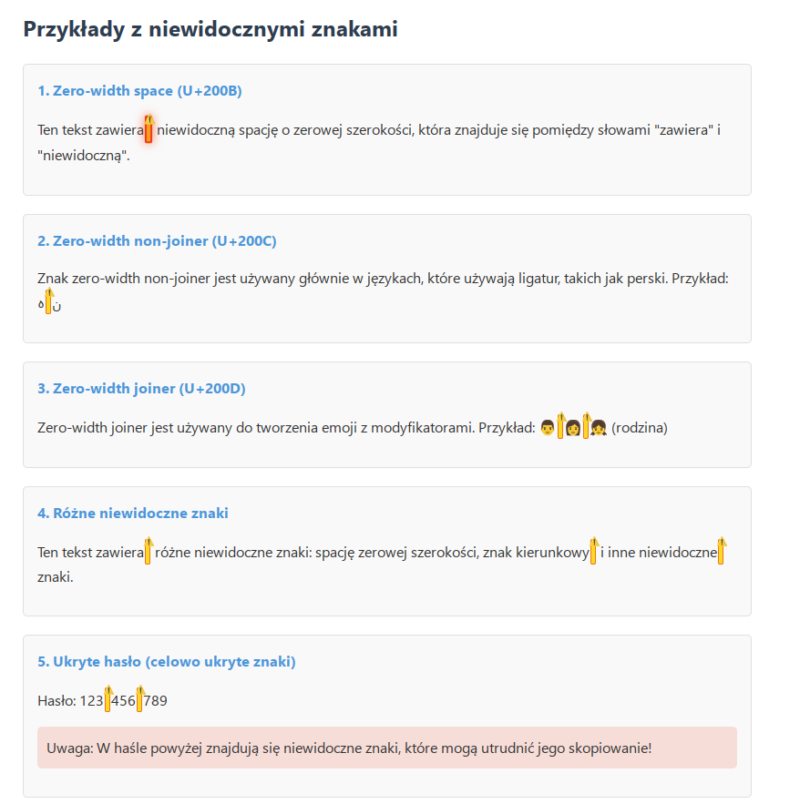

# Wykrywacz niewidocznych znaków

Wtyczka do przeglądarki Chrome służąca do wyszukiwania i podświetlania niewidocznych znaków, takich jak zero-width space (U+200B) i zero-width non-joiner (U+200C).

## Funkcje

- Wyszukiwanie i podświetlanie niewidocznych znaków na stronach internetowych
- **Pełna obsługa Dokumentów Google** - wykrywanie niewidocznych znaków w edytowalnych dokumentach
- Możliwość dostosowania listy wyszukiwanych znaków
- Statystyki znalezionych znaków
- Wyraźne podświetlanie niewidocznych znaków z animacją
- Obsługa chronionych stron (chrome://, about://)
- Nawigacja między znalezionymi znakami
- Rozbudowana lista 85+ znaków specjalnych i niewidocznych

## Domyślnie wyszukiwane znaki

### Podstawowe znaki niewidoczne
- Zero-width space (U+200B) - niewidoczna spacja o zerowej szerokości
- Zero-width non-joiner (U+200C) - znak zapobiegający łączeniu znaków
- Zero-width joiner (U+200D) - znak wymuszający łączenie znaków
- Left-to-right mark (U+200E) - niewidoczny znak sterujący kierunkiem tekstu od lewej do prawej
- Right-to-left mark (U+200F) - niewidoczny znak sterujący kierunkiem tekstu od prawej do lewej
- Word joiner (U+2060) - niewidoczny znak łączący słowa, podobny do ZWSP
- Function application (U+2061) - niewidoczny znak matematyczny "zastosowania funkcji"
- Invisible times (U+2062) - niewidoczny znak mnożenia w notacji matematycznej
- Invisible separator (U+2063) - niewidoczny separator w notacji matematycznej
- Invisible plus (U+2064) - niewidoczny znak dodawania w notacji matematycznej
- Hair space (U+200A) - bardzo wąska spacja
- Narrow no-break space (U+202F) - wąska niełamliwa spacja
- Medium mathematical space (U+205F) - średnia spacja matematyczna
- Soft hyphen (U+00AD) - miękki łącznik, widoczny tylko przy łamaniu linii
- Object replacement character (U+FFFC) - znak zastępujący obiekt
- Byte order mark (BOM) (U+FEFF) - znacznik kolejności bajtów

### Dodatkowe znaki Unicode
- Mongolian Vowel Separator (U+180E) - cienka spacja w piśmie mongolskim
- Left-to-Right Override (U+202D) - wymusza kierunek zapisu od lewej do prawej
- Right-to-Left Override (U+202E) - wymusza kierunek zapisu od prawej do lewej
- Left-to-Right Isolate (U+2066) - izoluje fragment tekstu od lewej do prawej
- Right-to-Left Isolate (U+2067) - izoluje fragment tekstu od prawej do lewej
- First Strong Isolate (U+2068) - izoluje tekst i wykrywa pierwszy mocny kierunek
- Pop Directional Isolate (U+2069) - kończy izolację kierunku
- Inhibit/Activate Arabic Form Shaping (U+206A, U+206B) - przestarzałe znaki kontrolne
- National/Nominal Digit Shapes (U+206C, U+206D) - przestarzałe znaki kontrolne
- Activate/Inhibit Symmetrical Swapping (U+206E, U+206F) - przestarzałe znaki kontrolne
- Ideographic Space (U+3000) - pełnoszerokowa spacja w CJK
- Hangul Filler (U+3164) - pusty glif, używany w koreańskim Hangul
- Braille Pattern Blank (U+2800) - niewidoczny znak brajlowski stałej szerokości
- Variation Selectors 1-16 (U+FE00-U+FE0F) - modyfikatory poprzedniego znaku
- Language Tag (U+E0001) - tag języka
- Tag Space (U+E0020) - spacja używana w tagach
- Cancel Tag (U+E007F) - anuluje działanie tagu

### Znaki interpunkcyjne i specjalne
- En dash (U+2013) - myślnik średniej długości
- Left/Right single quotation mark (U+2018, U+2019) - cudzysłowy pojedyncze
- Left/Right double quotation mark (U+201C, U+201D) - cudzysłowy podwójne
- Paragraph separator (U+2029) - separator akapitu
- End of text (U+0003) - znak końca tekstu
- Line tabulation (U+000B) - tabulacja pionowa
- Non breaking space (U+00A0) - niełamliwa spacja
- Pop directional formatting (U+202C) - kończy formatowanie kierunkowe

### Kontrolne znaki formatujące
- Tab (U+0009) - znak tabulacji
- Line Feed (U+000A) - znak nowej linii
- Form Feed (U+000C) - znak wysunięcia strony
- Carriage Return (U+000D) - znak powrotu karetki

### Białe znaki specjalne
- Em Space (U+2003) - spacja o szerokości litery "M"
- En Space (U+2002) - spacja o szerokości litery "N"
- Thin Space (U+2009) - cienka spacja
- Figure Space (U+2007) - spacja o szerokości cyfry
- Punctuation Space (U+2008) - spacja o szerokości znaku interpunkcyjnego
- Four-Per-Em Space (U+2005) - spacja o szerokości 1/4 "M"
- Six-Per-Em Space (U+2006) - spacja o szerokości 1/6 "M"

### Znaki matematyczne i specjalne
- Mathematical Minus (U+2212) - matematyczny minus
- Multiplication Sign (U+00D7) - znak mnożenia
- Division Sign (U+00F7) - znak dzielenia
- Line Separator (U+2028) - separator linii
- Ogham Space Mark (U+1680) - spacja w piśmie Ogham
- Arabic Letter Mark (U+061C) - marker kierunku tekstu arabskiego

### Znaki podobne do standardowych
- Greek Question Mark (U+037E) - grecki znak zapytania (wygląda jak średnik)
- Full-width Semicolon (U+FF1B) - szeroki średnik
- Full-width Comma (U+FF0C) - szeroki przecinek
- Full-width Period (U+FF0E) - szeroka kropka

### Inne znaki sterujące
- Substitute (U+001A) - znak zastępczy
- Escape (U+001B) - znak ucieczki
- Delete (U+007F) - znak usunięcia

### Znaczniki dla adnotacji
- Interlinear Annotation Anchor (U+FFF9) - kotwica adnotacji międzyliniowej
- Interlinear Annotation Separator (U+FFFA) - separator adnotacji międzyliniowej
- Interlinear Annotation Terminator (U+FFFB) - terminator adnotacji międzyliniowej

## Instalacja

1. Otwórz Chrome i przejdź do `chrome://extensions/`
2. Włącz "Tryb dewelopera" (przełącznik w prawym górnym rogu)
3. Kliknij przycisk "Załaduj rozpakowane" i wybierz folder z wtyczką
4. Wtyczka powinna pojawić się na liście zainstalowanych rozszerzeń

## Podgląd działania



*Na powyższym obrazku widać interfejs wtyczki oraz sposób podświetlania niewidocznych znaków na stronie.*

### Wykrywanie niewidocznych znaków

Wtyczka podświetla niewidoczne znaki na stronie, czyniąc je łatwymi do wykrycia:

```
Normalny tekst zawiera​niewidoczne​znaki, które są trudne do zauważenia.
```

Po aktywacji wtyczki:

```
Normalny tekst [ZWSP] zawiera [ZWSP] niewidoczne [ZWSP] znaki, które są trudne do zauważenia.
```

### Interfejs użytkownika

Wtyczka oferuje przejrzysty interfejs użytkownika z następującymi elementami:
- Panel z przyciskami "Podświetl niewidoczne znaki" i "Wyczyść podświetlenia"
- Przełącznik trybu automatycznego
- Panel nawigacji z przyciskami "Poprzedni" i "Następny"
- Listę wykrywanych znaków z możliwością edycji
- Sekcję statystyk pokazującą znalezione znaki

### Tryb automatyczny

Po włączeniu trybu automatycznego ikona wtyczki zmienia wygląd, sygnalizując aktywny tryb:
- Standardowa ikona:  (tryb manualny)
- Ikona w trybie automatycznym:  (skanowanie automatyczne)

### Nawigacja po znakach

Po znalezieniu niewidocznych znaków, wtyczka umożliwia nawigację między nimi:
- Aktualnie wybrany znak jest podświetlony z animacją pulsowania
- Licznik pokazuje bieżącą pozycję i łączną liczbę znalezionych znaków (np. "3/7")
- Przyciski "Poprzedni" i "Następny" pozwalają łatwo przemieszczać się między znakami

## Użycie

1. Kliknij ikonę wtyczki na pasku narzędzi Chrome
2. Kliknij przycisk "Podświetl niewidoczne znaki", aby wyszukać i podświetlić niewidoczne znaki na aktualnie otwartej stronie
3. Użyj przycisku "Wyczyść podświetlenia", aby usunąć podświetlenia
4. Możesz edytować listę wyszukiwanych znaków w polu tekstowym i zapisać ją za pomocą przycisku "Zapisz listę"
5. Użyj przycisków "Poprzedni" i "Następny" do nawigacji między znalezionymi znakami
6. Włącz opcję "Tryb automatyczny", aby wtyczka automatycznie skanowała każdą odwiedzaną stronę:
   - Po włączeniu tej opcji, ikona wtyczki zmieni swój wygląd na pomarańczowy z zielonym znacznikiem "A"
   - Wszystkie niewidoczne znaki będą automatycznie podświetlane na każdej stronie
   - Możesz w dowolnym momencie wyłączyć tę opcję, aby powrócić do trybu manualnego

### Korzystanie z Dokumentami Google

Wtyczka obsługuje również Dokumenty Google, co pozwala na wykrywanie niewidocznych znaków w edytowalnych dokumentach:

1. Otwórz dokument Google
2. Kliknij ikonę wtyczki i wybierz "Podświetl niewidoczne znaki"
3. Wtyczka przeskanuje zawartość dokumentu, w tym tekst w obszarach edytowalnych
4. Znalezione niewidoczne znaki zostaną podświetlone w sposób, który nie zakłóca dalszej edycji dokumentu
5. Możesz używać przycisków nawigacji, aby przechodzić między znalezionymi znakami

## Dodawanie własnych znaków do wyszukiwania

Format dodawania znaków w polu edycji:
```
Nazwa znaku,Kod Unicode
```

Przykład:
```
Zero-width space,U+200B
Zero-width non-joiner,U+200C
Word joiner,U+2060
```

## Informacje techniczne

Wtyczka wykorzystuje:
- Manifest V3 dla rozszerzeń Chrome
- Chrome Storage API do przechowywania ustawień
- Chrome Scripting API do wstrzykiwania skryptów
- Service Worker (background.js) do obsługi trybu automatycznego
- MutationObserver do wykrywania zmian w DOM
- Chrome Messaging API do komunikacji między komponentami

Struktura projektu:
- `manifest.json` - plik konfiguracyjny rozszerzenia
- `popup.html` - interfejs użytkownika z kontrolkami
- `popup.js` - logika interfejsu i komunikacja z content.js
- `content.js` - wykrywanie i podświetlanie niewidocznych znaków
- `background.js` - service worker odpowiedzialny za tryb automatyczny
- `styles.css` - style dla podświetlania i interfejsu
- `images/` - ikony w różnych rozmiarach i wariantach
- `test_page.html` - strona testowa z przykładami niewidocznych znaków

## Znane ograniczenia

- Wtyczka nie wykrywa znaków w elementach iframe z innych domen (ograniczenie bezpieczeństwa)
- Niektóre strony z zaawansowanym JavaScript mogą dynamicznie modyfikować DOM, co może wpływać na podświetlenia
- Znaki Unicode z wyższych płaszczyzn (np. niektóre znaki TAG) mogą nie być obsługiwane w starszych przeglądarkach
- Wtyczka nie działa na stronach chrome:// i about:// ze względu na ograniczenia bezpieczeństwa Chrome
- W Dokumentach Google, niektóre zaawansowane formatowania mogą wpływać na dokładność wykrywania

## Ostatnie aktualizacje

### Wersja 1.4 (29.04.2025)
- Dodano pełną obsługę Dokumentów Google
- Dodano rozszerzoną listę 85+ specjalnych i niewidocznych znaków
- Ulepszono podpowiedzi dla znalezionych znaków
- Zoptymalizowano wykrywanie znaków w obszarach edytowalnych
- Poprawiono nawigację między znalezionymi znakami

### Wersja 1.3 (29.04.2025)
- Naprawiono działanie trybu automatycznego przy przełączaniu między kartami
- Zoptymalizowano kod do skanowania kart poprzez wydzielenie wspólnej funkcjonalności
- Poprawiono obsługę zdarzeń przeglądarki dla lepszego wykrywania znaków

### Wersja 1.2 (29.04.2025)
- Ulepszono interfejs użytkownika z rozwijanymi sekcjami funkcji
- Dodano obsługę chronionych stron (chrome://, about://)
- Rozbudowano listę wspieranych znaków Unicode (50+ typów)
- Poprawiono obsługę błędów i raportowanie problemów

### Wersja 1.1 (poprzednia)
- Dodano tryb automatycznego skanowania
- Dodano nawigację po znalezionych znakach (Poprzedni/Następny)
- Dodano animacje dla lepszej widoczności znalezionych znaków
- Rozszerzono listę wspieranych znaków Unicode

## Diagnostyka problemów

Jeśli wtyczka nie działa poprawnie:
1. Upewnij się, że wtyczka ma uprawnienia do wszystkich stron (`<all_urls>`)
2. Sprawdź, czy tryb automatyczny jest włączony, jeśli oczekujesz automatycznego skanowania
3. Odśwież stronę po włączeniu trybu automatycznego
4. Sprawdź konsolę deweloperską (`F12`) pod kątem błędów
5. W przypadku problemów z Dokumentami Google, upewnij się, że masz zainstalowaną najnowszą wersję wtyczki

## Licencja

MIT

## Autor

Oryginalny pomysł i implementacja: Rafał Skonieczka
